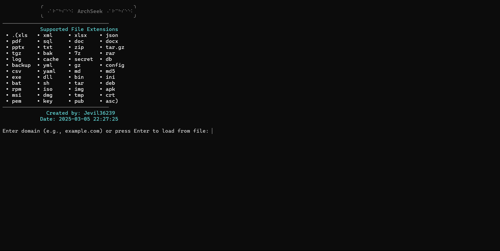
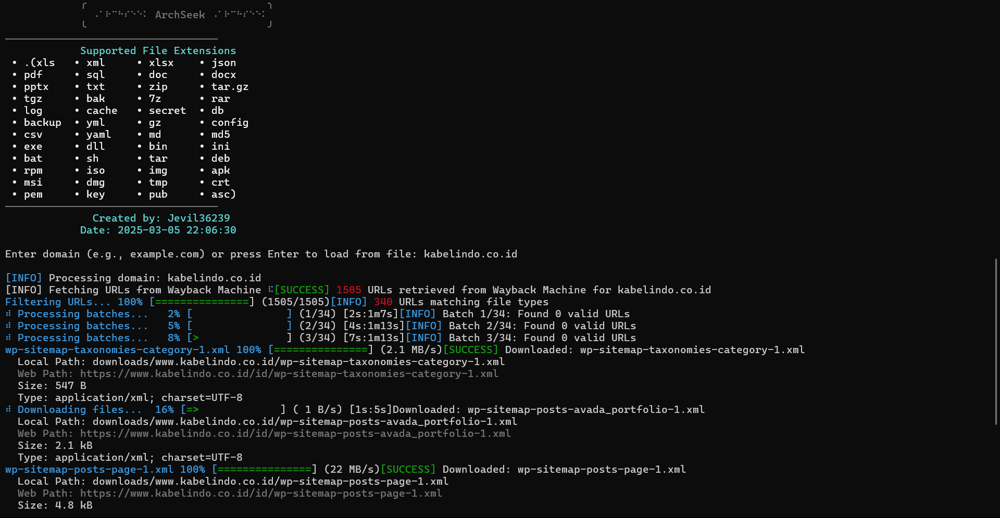
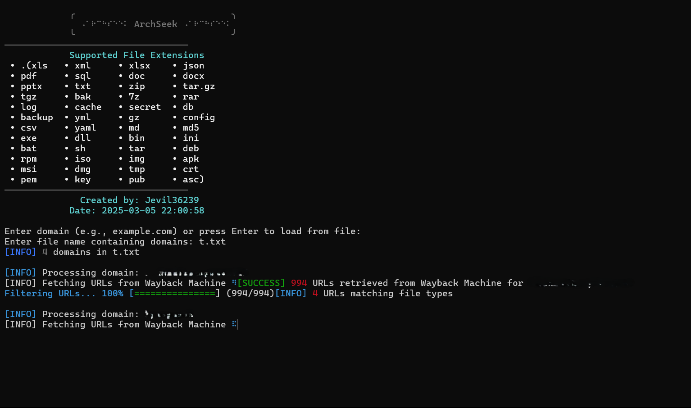
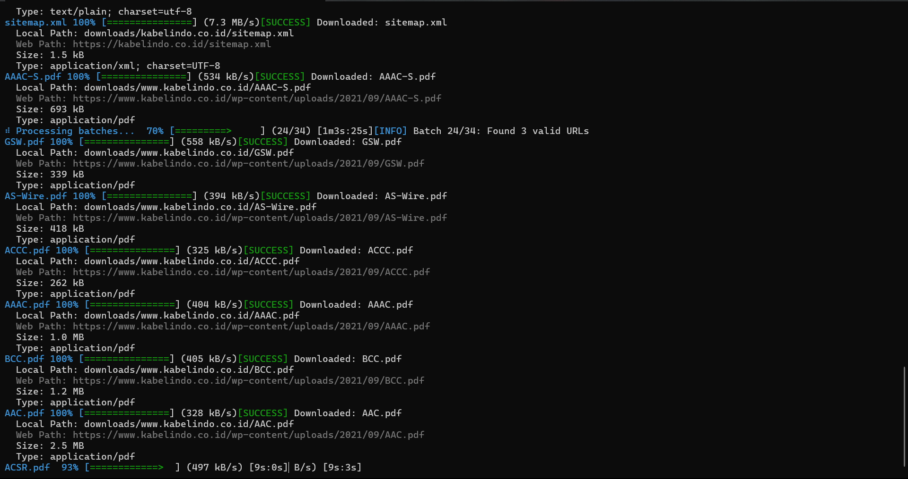
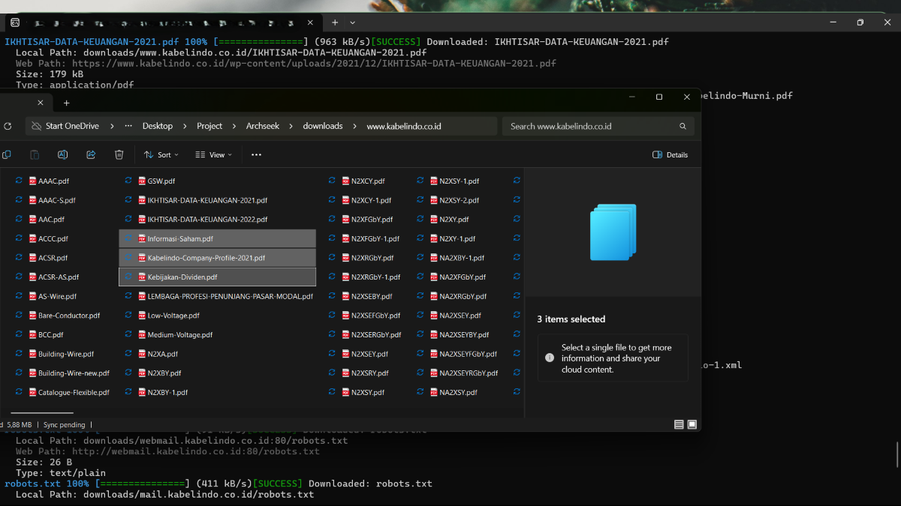

# `⠠⠁⠗⠉⠓⠎⠑⠑⠅` (Archseek)

```

  ⠁⠗⠉⠓⠎⠑⠑⠅⠀⠊⠎⠀⠁⠀⠛⠕⠀⠁⠏⠏⠇⠊⠉⠁⠞⠊⠕⠝⠀⠞⠓⠁⠞⠀⠑⠭⠞⠗⠁⠉⠞⠎⠀⠁⠝⠙⠀⠋⠊⠇⠞⠑⠗⠎⠀⠥⠗⠇⠎⠀⠋⠗⠕⠍⠀⠁⠗⠉⠓⠊⠧⠑⠙⠀⠺⠁⠽⠃⠁⠉⠅⠀⠍⠁⠉⠓⠊⠝⠑⠀⠙⠁⠞⠁⠀⠃⠁⠎⠑⠙⠀⠕⠝⠀⠎⠏⠑⠉⠊⠋⠊⠉⠀⠋⠊⠇⠑⠀⠞⠽⠏⠑⠎⠀⠇⠊⠅⠑⠀⠲⠏⠙⠋⠂⠀⠲⠵⠊⠏⠂⠀⠲⠎⠟⠇⠂⠀⠲⠭⠇⠎⠂⠀⠁⠝⠙⠀⠍⠕⠗⠑⠲⠀⠊⠞⠀⠉⠓⠑⠉⠅⠎⠀⠞⠓⠑⠀⠁⠧⠁⠊⠇⠁⠃⠊⠇⠊⠞⠽⠀⠕⠋⠀⠑⠁⠉⠓⠀⠥⠗⠇⠂⠀⠎⠁⠧⠊⠝⠛⠀⠧⠁⠇⠊⠙⠀⠕⠝⠑⠎⠀⠺⠊⠞⠓⠀⠁⠀⠼⠃⠚⠚⠀⠕⠅⠀⠗⠑⠎⠏⠕⠝⠎⠑⠀⠞⠕⠀⠁⠀⠞⠑⠭⠞⠀⠋⠊⠇⠑⠲⠀⠏⠑⠗⠋⠑⠉⠞⠀⠋⠕⠗⠀⠺⠑⠃⠀⠎⠉⠗⠁⠏⠊⠝⠛⠂⠀⠗⠑⠎⠑⠁⠗⠉⠓⠂⠀⠕⠗⠀⠗⠑⠞⠗⠊⠑⠧⠊⠝⠛⠀⠓⠊⠎⠞⠕⠗⠊⠉⠁⠇⠀⠋⠊⠇⠑⠎⠀⠋⠗⠕⠍⠀⠁⠗⠉⠓⠊⠧⠑⠙⠀⠙⠕⠍⠁⠊⠝⠎⠲
  
```

**Archseek** is a Go application that extracts and filters URLs from archived Wayback Machine data based on specific file types like `.pdf`, `.zip`, `.sql`, `.xls`, and more. It checks the availability of each URL, saving valid ones with a 200 OK response to a text file. Perfect for web scraping, research, or retrieving historical files from archived domains.

---

@coffinxp💗 Thank you for the Inspiration.
## Features

- Fetch URLs from Wayback Machine for a given domain.
- Filter URLs by specific file extensions such as `.pdf`, `.zip`, `.xls`, `.sql`, `.txt`, and more.
- Configurable file extensions for specialized searches
- Validate URLs by checking their response status (200 OK).
- Option to process multiple domains by providing a text file with domain names.
- Saves valid URLs to a text file.
- Progress bar to show the URL checking process.
- Clean, easy-to-read, colored output in the terminal.

> [!NOTE]
> FileFetcher is optimized for retrieving historical files from archived domains. Ensure you have proper permissions for the domains you're accessing.

---

## Requirements

- Go 1.16+
- `github.com/fatih/color`
- `gopkg.in/ini.v1`


---

## Installation

> [!TIP]
> Use a virtual environment to manage dependencies and avoid conflicts with other Python projects.

1. Clone this repository to your local machine:

```bash
git clone https://github.com/Jevil36239/Archseek.git
cd Archseek
go build -o archseek main.go
```

2. Install dependencies using Go modules:

```bash
go mod tidy
go build
```

> [!IMPORTANT]
> Ensure you have the Supported version of Golang installed before proceeding with the installation.


---

## Configuration

### Batch Processing Settings

```
# Paste your configuration here
# Example:

# [BatchProcessing]
# BatchSize = 10
# MaxThreads = 50
# Timeout = 30
```

### Resource Usage Levels

1. **Default** (Recommended for most users):
   - Batch Size: 10
   - Max Threads: 50
   - Timeout: 5 seconds

2. **High Performance**:
   - Batch Size: 50
   - Max Threads: 10
   - Timeout: 10 seconds

3. **BAT SHIT INSANE**:
   - Batch Size: 100
   - Max Threads: 20
   - Timeout: 30 seconds

> [!WARNING]
> Using other than Default settings may consume significant system resources. Use with caution on low-performance machines.

---

## Input Options

You can use the script in two ways:

1. **Single Domain**: 
   - When prompted, enter a domain (e.g., `example.com`).
   - The script will extract URLs related to the provided domain.

2. **Multiple Domains from a File**: 
   - Press Enter to load domains from a file.
   - Provide the file name containing domains, one per line.
   - Example input file:
     ```
     example1.com
     example2.com
     example3.com
     ```

> [!CAUTION]
> Ensure the domains you're accessing are not protected by copyright or other legal restrictions.

---

## Author

- **Name**: Jevil36239
- **GitHub**: [Jevil36239](https://github.com/Jevil36239)


## Screenshots

### Main Interface


The main interface of Archseek, showing the domain input and processing options.

---
### URL Filtering in Action



Demonstrating the URL filtering process based on file extensions.

---
### in Action


Showing the progress bar during URL validation with 200 OK status checks and Downloading the files.

---
### successful retrieval of important files


Displaying successful retrieval of important files from archived domains with their metadata and download status.

